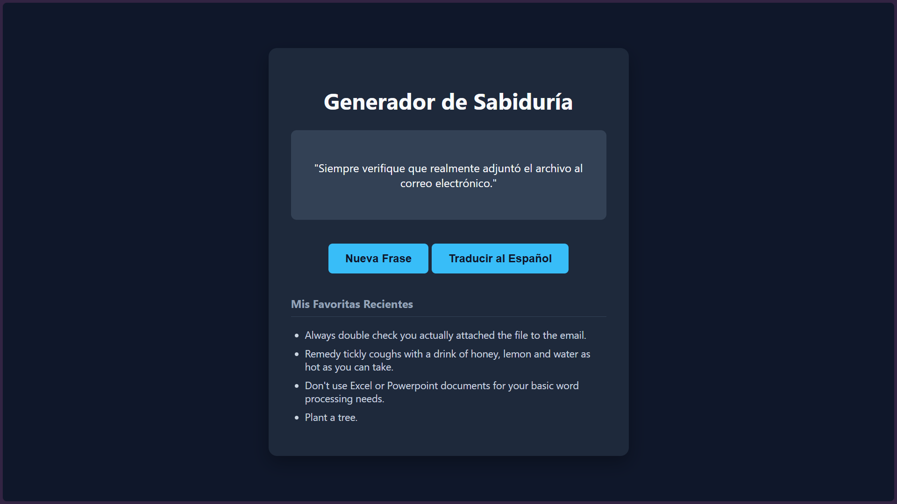

# 💡 Generador de Consejos y Traductor

Una aplicación web sencilla desarrollada con JavaScript vainilla que consume la API [Advice Slip](https://api.adviceslip.com/) para mostrar frases de sabiduría en inglés y permite traducirlas al español utilizando la API de MyMemory. Además, guarda un historial local de las últimas frases usando `localStorage`.

## 📸 Vista previa

## 🚀 Tecnologías utilizadas
* HTML5 / CSS3
* JavaScript (ES6+, `fetch`, `async/await`)
* LocalStorage API
* APIs externas (Advice Slip y MyMemory Translation)

## 📦 Cómo probarlo localmente
1. Clona este repositorio o descarga los archivos ZIP.
2. Abre el archivo `index.html` en tu navegador web favorito (o usa una extensión como *Live Server* en VS Code).
